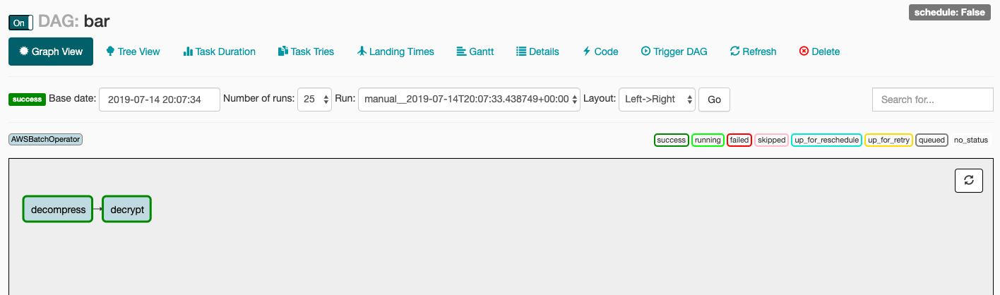
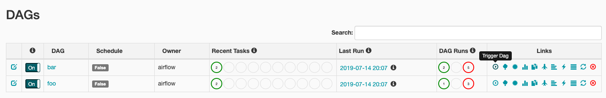

# AWS Batch Demo

This demo shows how to use Airflow and AWS Batch to create robust, cost efficient, and highly scalable data pipelines. This is done through example by developing a data pipeline that has two steps, decompressing an encrypted file, and then decrypting the file. To accomplish this, an AWS Batch Compute Environment is provisioned with two Job Definitions for each step in the pipeline. A sample view of the DAG run can be seem below.



## Requirements

- Python 3
- Docker
- Terraform

## Setup

- Alter the variable "name" in main.tf to be a unique S3 bucket, not already taken. Update "AWS_ASSETS_NAME" in the Makefile to reflect this change.
- Provision the AWS Batch Compute Environment and Job Definitions in a new VPC and subnet with appropriate security configuration.

```bash
# Plan changes
terraform plan

# Apply changes
terraform apply
```

- Upload the local text files in `assets` to S3.

```bash
make copy-s3
```

- Build, tag, and push docker image to ECR to be used by Batch

```bash
make push
```

- Launch airflow

```bash
docker-compose up
```

- Go to Airflow's UI at [http://localhost:8080/](http://localhost:8080/) and trigger a job



- Watch as Airflow spins up containers in an EC2 instance, runs your jobs, and then terminates the EC2 instance for you. What an elegant way to run batch computing jobs in a directed pipeline!

- Destroy your Terraform resources

```bash
terraform destroy
```

## Additional Commands Useful for Development

### Python CLI Installation

Used for running the CLI tool as a standalone tool

```bash
$ pip install git+https://github.com/petedannemann/aws-batch-demo#egg=decompress-decrypt
```

### Python CLI Usage

```bash
$ decompress-decrypt --help
Usage: decompress-decrypt [OPTIONS] COMMAND [ARGS]...

  Command line tool to decompress and decrypt files.

Options:
  --help  Show this message and exit.

Commands:
  decompress  Simple program that decompresses an input file and writes it...
  decrypt     Simple program that decrypts an input file and writes it to
              an...

$ decompress-decrypt decompress --help
Usage: decompress-decrypt decompress [OPTIONS]

  Simple program that decompresses an input file and writes it to an output
  file.

Options:
  -i, --input-file-path TEXT   The path of the input file, local or S3
                               (s3://...)
  -o, --output-file-path TEXT  The path of the output file, local or S3
                               (s3://...)
  --help                       Show this message and exit.

$ decompress-decrypt decrypt --help
Usage: decompress-decrypt decrypt [OPTIONS]

  Simple program that decrypts an input file and writes it to an output
  file.

Options:
  -i, --input-file-path TEXT   The path of the input file, local or S3
                               (s3://...)
  -o, --output-file-path TEXT  The path of the output file, local or S3
                               (s3://...)
  -f, --fernet-key TEXT        The decrpytion key.
  --help                       Show this message and exit.
```

### Terraform Commands

```bash
# Initialize terraform
terraform init

# Plan changes
terraform plan

# Apply changes
terraform apply

# Destroy resources
terraform destroy
```

### Makefile Commands

```bash
# Copy local file to S3
make copy-s3

# Build docker image
make build

# Tag docker image
make tag

# Build, tag, and push docker image to ECR
make push

# Submit the job to AWS Batch
make submit-job

# Launch airflow
docker-compose up
```
